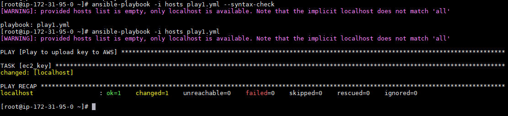
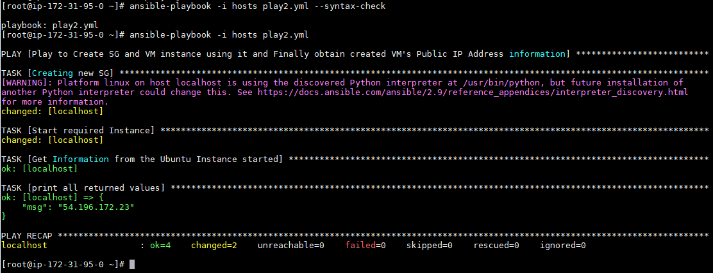
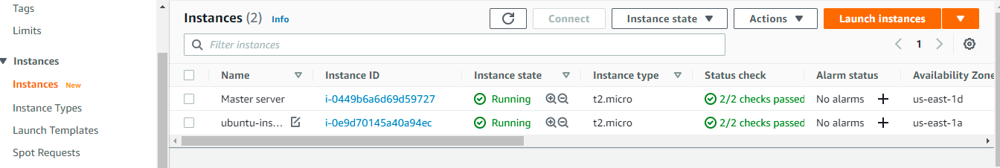
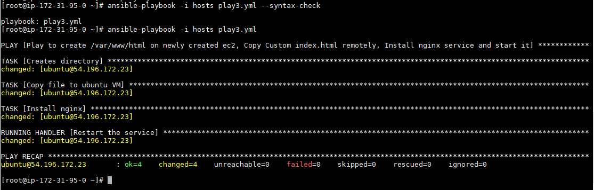
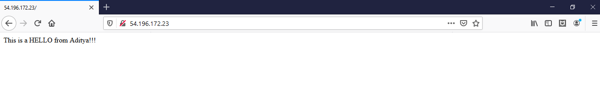

# Ansible_Live
<a href="mailto:aditya_ag2301@yahoo.in"> </a>   &emsp;&emsp;&emsp;&emsp;&emsp;&emsp;&emsp;&emsp;&emsp;&emsp;&emsp;&emsp;&emsp;&emsp;&emsp;&emsp;&emsp;&emsp;&emsp;&emsp;&emsp;&emsp;&emsp;&emsp;&emsp;&emsp;&emsp;&emsp;&emsp;&emsp;<a href="https://github.com/boudhayan-dev/Automatic-Waste-Segregator/tree/v.01"></a>
<br>

Remotely creating an ec2 instance on AWS cloud and host webpage with personalized content


### Requirements
##### To run on Ansible Master server
- \# yum update -y
- \# sudo amazon-linux-extras install epel -y
- \# yum install -y $(cat yum_require.txt)
- \# pip install -r pip_require.txt


### Setup
##### Step 1: Generate key to be shared on Master Server and follow prompts

```
# ssh-keygen
```
<pre>
Generating public/private rsa key pair.
Enter file in which to save the key (/root/.ssh/id_rsa):
Enter passphrase (empty for no passphrase):
Enter same passphrase again:
Your identification has been saved in /root/.ssh/id_rsa.
Your public key has been saved in /root/.ssh/id_rsa.pub.
The key fingerprint is:
SHA256:zzzzzzzzzzzzzzzzzzzzzzzzzzzzzzzzzzzzzzzzzzz root@ip-172-31-95-0.ec2.internal
The key's randomart image is:

+---[RSA 2048]----+
|      .          |
|     o .  o .    |
|      +.oo.+.    |
|     . =O**++o   |
|      ooSO==oo   |
|       = = .+ .  |
|      . . = o. . |
|         . *..+  |
|          .o**E  |
+----[SHA256]-----+
</pre>

##### Step 2: Add AWS Cloud Programatic Access Credentials in place of xxxxx and yyyyy and enter region to work. (Here default North Virgina is chosen)

```
# aws configure
```
<pre>
AWS Access Key ID [None]: xxxxxxxxxxxxxxxxxxxx
AWS Secret Access Key [None]: yyyyyyyyyyyyyyyyyyyyyyyyyyyyyyyyyyyyyyyy
Default region name [None]: us-east-1
Default output format [None]:
</pre>

##### Step 3: In ansible.cfg uncomment the following parameter for disable ssh connectivity prompt
<pre>
host_key_checking = False
</pre>

##### Step 4: Test working on the Ansible

```
# ansible localhost -m ping
```
<pre>
localhost | SUCCESS => {
    "changed": false,
    "ping": "pong"
}
</pre>

### Working
##### Step 1: Run **play1.yml** to add copy public key created to AWS
<a href="https://github.com/aditya2301/Ansible_Live/tree/main/"></a>

##### Step 2: Run **play2.yml** to create a security group and an ec2 instance using it and get Public Ipv4 address from the instance to connect to remotely
<a href="https://github.com/aditya2301/Ansible_Live/tree/main/"></a>
<br>
<br>
<a href="https://github.com/aditya2301/Ansible_Live/tree/main/"></a>

##### Step 3: Update inventory file **hosts** with \<username\>@\<IP of VM\> obtained in Step 2 under [VM]

##### Step 4: Run **play3.yml** to create /var/www/html directory on the created VM and copy index.html to the VM -> Install nginx service and restart service
<a href="https://github.com/aditya2301/Ansible_Live/tree/main/"></a>

##### Step 5: Open browser and check content by running \<IP of VM\>:\<port 80(optional) \>
<a href="https://github.com/aditya2301/Ansible_Live/tree/main/"></a>

<br>

### Author
#### Aditya Agarwal
- LinkedIn: https://www.linkedin.com/in/aditya-ag-2301/ 
- Github: https://github.com/aditya2301/

<br>

###### © All rights reserved.
